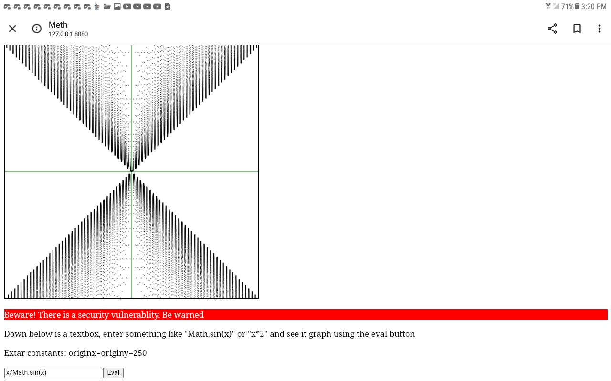

# Description 
A simple javascript grapher. 

## WARNING: DO NOT USE IN WEBSITES. VULNERABLE 

You have x and y to work with. The `y=` is already added at the start no need to add it; 

Example:
```js
x*Math.sin(x)
```


